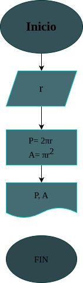

# Programa #1
Programa para calcular el área y el perímetro de un circulo de radio r

# Análisis

## Input
### Variables de entrada
r: radio del circulo 
### Processing
P= perímetro del circulo
P: 2πr 

A= área del circulo
A= πr*r

### Output
A, P
# Diseño

# Construcción